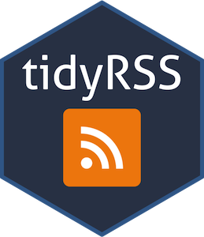

# Janecskó? 

A Telex Neked hírlevél 25. számában ragadta meg a fantáziámat ez a pár mondat: 

> Sziasztok,
> engem Janecskó Katának hívnak, újságíró vagyok a Telexnél. 
> A barátaimtól állandóan azt hallom, hogy már a cím alapján megmondják egy cikkről, hogy én írtam, és őszintén szólva ebben tényleg lehet valami

Mivel ez a hirlevél épp egybe esett az R Data Science hobbi-tanulmányaim szöveg elemzési részével, felmerült bennem a kérdés, hogy: 

**valóban így van-e?**
Készíthető olyan model, ami a cím vagy esetleg a teljes tartalom alapján el tudja dönteni, hogy Janecskó Kata a szerző vagy valaki más? 

## Hogyan is fogjunk hozzá? 

Átgondolva nagyjából erre a módszeranra jutott a választásom: 

* letölteni az internetről minél több Telex cikket
  + azzal a meta adattal együtt, hogy ki írta őket
  + fontos, hogy ne legyenek Kata cikkei nagyobb arányban mint ami ésszerű 
* az így összegyűjtött adatokat az exploratory data analysis módszereivel megérteni és vizualizálni 
* dolgozzuk fel a cimeket a [tidytext](https://www.tidytextmining.com/) adta lehetőségeket kihasználva 
  + szavakat, szópárokat és (a cikkek hosszának függvényében) szó hármasokat fogunk használni
* keressünk olyan gépi tanulási modelt, ami a lehető legjobb arányban ismeri fel Kata írásait
* értelmezzük a model működését 
* nem csak a cimekre, hanem a teljes tartalomra fókuszálva keressük meg azt a modelt, ami alapján Kata cikkei felismerhetőek 
* értelmezzük az eredeményeket ismét 
* amennyiben értékelhető megoldást találunk a fenti kérdésre vegyük fel a kapcsolatot a Telex újságírójával és mutassuk meg neki, hogy igaza van a barátainak :D 

## Alkalmazott technológiák: 

*  [R](https://www.r-project.org/) 
*  [R Studio](https://www.rstudio.com/) 
* a következő csomagokkal kiegészítve: 
  + {width=5%} [tidyverse](https://tidyverse.org/) mert manapság elképzelni is nehéz a hatékony és olvasható R kódot nélküle 
  + {width=5%} [tidytext](https://www.tidytextmining.com/) kifejezetten a tidyverse-be illeszkedő szöveg elemző eszköztár 
  + {width=5%} [tidymodels](https://www.tidymodels.org/) model alkotás egyszerűen szintén a tidyverse logikája szerint
  + {width=5%} [tidyRSS](https://github.com/RobertMyles/tidyRSS) mivel a Telexen van RSS csatorna, amit ráadásul lehet újságíróra szűrni, így ezen a módon fogunk cikkekhez jútni 
  + lubridate
  + rvest 
  + glue 
* {width=5%} [github](https://github.com/) verzió kezelésre 

